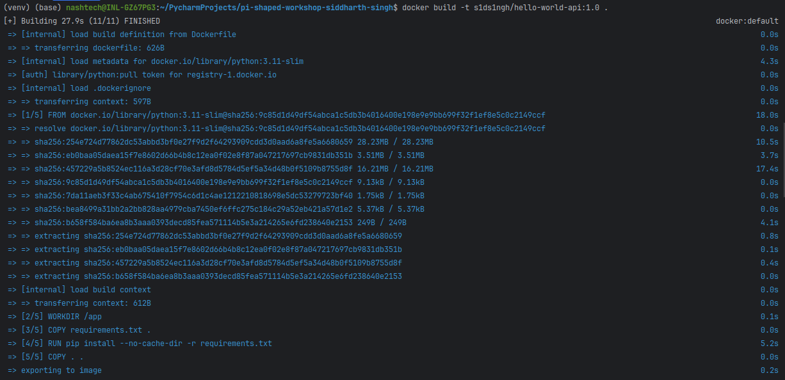
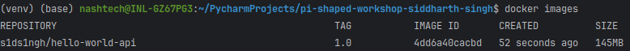
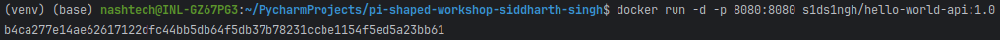
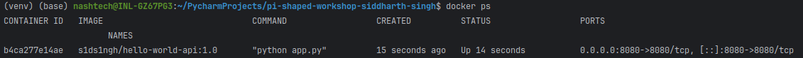
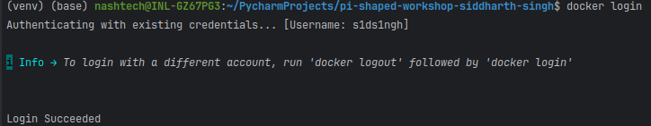
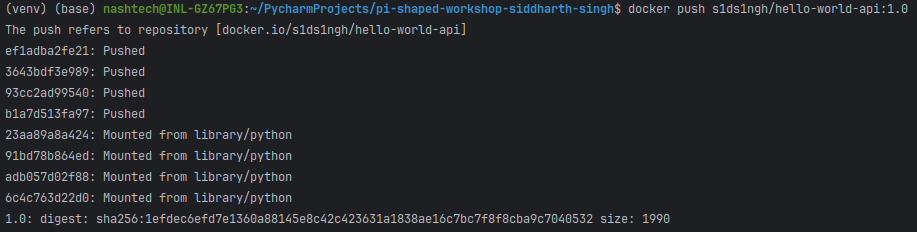
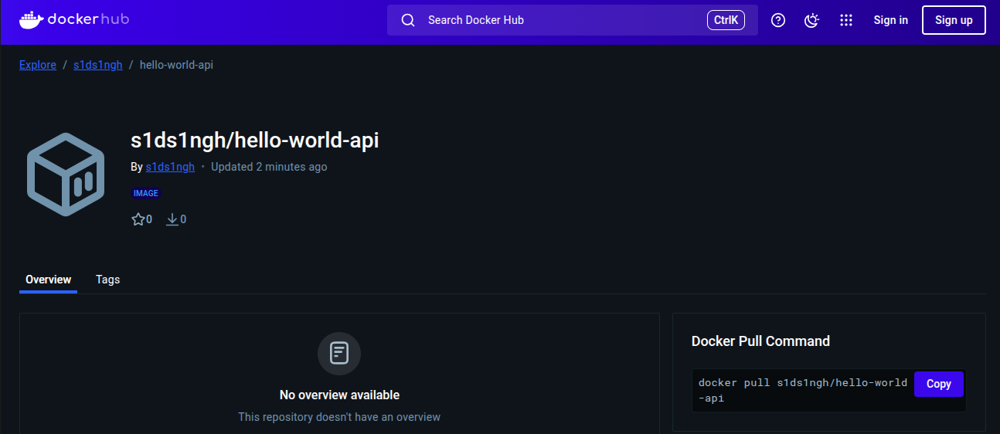

# Docker & Kubernetes Assignment

This repository contains a simple Python REST API containerized with Docker as part of the "Introduction to Docker & Kubernetes, Containerization Basics" assignment.

## Project Structure

- `app.py` - A simple Flask REST API that returns a "Hello, World!" JSON response and includes a health check endpoint
- `Dockerfile` - Instructions for building the Docker container
- `requirements.txt` - Python dependencies (Flask)
- `docker_instructions.md` - Step-by-step guide for building, running, and pushing the Docker image
- `README.md` - Project documentation and assignment details
- `.dockerignore` - Specifies files and directories to exclude from Docker builds
- `.gitignore` - Specifies files and directories to exclude from Git version control

## Application Details

The application is a simple REST API built with Flask that offers:

1. A main endpoint that returns a JSON response when accessed:

```json
{
  "message": "Hello, World!",
  "status": "success",
  "service": "Docker Assignment REST API"
}
```

2. A health check endpoint at `/health` that can be used by container orchestrators like Kubernetes to monitor the application status.

The API runs on port 8080 and is containerized using Docker.

## Docker Instructions

Please refer to the [Docker Instructions](docker_instructions.md) file for detailed steps on:
- Building the Docker image
- Running the container locally on port 8080
- Pushing the image to Docker Hub

## Snapshots
### Building Docker Image

### Listing Docker Images

### Running Docker Container

### Listing Running Containers

### Testing the API

### Logging into Docker Hub

### Pushing Docker Image

### Verifying Docker Image on Docker Hub by visiting the link - https://hub.docker.com/r/s1ds1ngh/hello-world-api


## Core Concept Questions

### Why is Docker useful in building and deploying microservices for a real-world product (like an e-commerce or banking app)?

Docker provides significant advantages when building and deploying microservices for real-world applications like e-commerce platforms or banking systems. The containerization approach offered by Docker creates a consistent environment across development, testing, and production stages, eliminating the notorious "it works on my machine" problem that often plagues software development. This consistency is particularly valuable in microservices architectures where different teams may be responsible for different services, each potentially using different technology stacks or dependencies.

For an e-commerce application, Docker enables teams to independently develop, test, and deploy various components such as product catalog services, payment processing systems, user authentication modules, and recommendation engines. Each microservice can be containerized with its specific dependencies, libraries, and runtime environments without interfering with other services. This isolation ensures that updates or changes to one service don't unexpectedly impact others, reducing the risk of system-wide failures that could affect customer transactions or experiences.

In banking applications, where security and reliability are paramount, Docker's lightweight isolation provides an additional layer of security by containing potential vulnerabilities within specific containers. If a security issue is discovered in one microservice, it can be quickly patched and redeployed without disrupting the entire banking platform. Furthermore, Docker's efficient resource utilization allows banks to optimize infrastructure costs while maintaining the ability to scale specific services during peak transaction periods, such as month-end processing or holiday shopping seasons.

Docker also accelerates the continuous integration and continuous deployment (CI/CD) pipeline, enabling faster feature releases and bug fixes. For instance, when a new payment method needs to be added to an e-commerce platform, the payment service container can be updated, tested, and deployed independently, without requiring a full system redeployment. This agility is essential in competitive markets where rapid response to customer needs or market changes can provide a significant business advantage.

### What is the difference between a Docker image and a container in the context of scaling a web application?

In the context of scaling a web application, understanding the distinction between Docker images and containers is crucial for implementing effective scaling strategies. A Docker image is essentially a read-only template that contains the application code, runtime, libraries, environment variables, and configuration files needed to run the application. It's a blueprint or snapshot from which containers are instantiated. Images are built once and remain unchanged unless a new version is explicitly created, making them ideal for version control and ensuring consistency across deployments.

Containers, on the other hand, are the running instances created from these images. They are lightweight, isolated execution environments that include everything needed to run the application. When scaling a web application, you don't modify the image; instead, you create multiple container instances from the same image. This approach ensures that each container behaves identically, regardless of where it's deployed, which is essential for maintaining consistent user experiences across a distributed system.

For a web application experiencing increased traffic, horizontal scaling is achieved by spinning up additional containers from the same image across multiple hosts or cloud instances. Each container operates independently but serves the same application, allowing load balancers to distribute incoming requests among them. This container-based scaling provides granular control over resource allocation and enables rapid response to traffic fluctuations. For example, during a flash sale on an e-commerce site, dozens or hundreds of additional containers can be launched within seconds to handle the surge in user requests, then terminated when traffic returns to normal levels.

The immutability of images also facilitates reliable rollbacks in case of deployment issues. If a new version of the application introduces problems, traffic can be quickly redirected to containers running the previous image version, minimizing downtime and user impact. Additionally, the separation between images and containers supports blue-green deployment strategies, where new application versions can be deployed alongside existing ones, allowing for gradual traffic migration and risk mitigation.

### How does Kubernetes complement Docker when running a product at scale (e.g., hundreds of containers)?

Kubernetes complements Docker by providing a robust orchestration layer that automates the deployment, scaling, and management of containerized applications across distributed environments. While Docker excels at creating and running containers, it doesn't inherently address the complexities of managing hundreds or thousands of containers across multiple hosts, which is essential for running products at scale. Kubernetes fills this gap by offering a comprehensive platform that treats the entire infrastructure as a unified resource pool.

For large-scale applications requiring hundreds of containers, Kubernetes provides automated container placement based on resource requirements and constraints. It intelligently distributes containers across available nodes in the cluster, ensuring optimal resource utilization and application performance. This scheduling capability is particularly valuable for complex applications with varying resource profiles, such as CPU-intensive processing services and memory-intensive caching layers.

Kubernetes also delivers sophisticated self-healing mechanisms that continuously monitor container health and automatically replace failed containers. If a node becomes unresponsive or if a container crashes, Kubernetes detects the issue and reschedules the affected containers on healthy nodes, maintaining the desired application state without manual intervention. This resilience is crucial for maintaining service availability in production environments where downtime directly impacts user experience and business outcomes.

Horizontal scaling becomes effortless with Kubernetes' built-in autoscaling capabilities. Based on observed metrics like CPU utilization or custom application metrics, Kubernetes can automatically adjust the number of running containers to match current demand. For instance, an e-commerce platform might experience predictable traffic patterns with daily peaks during evening hours and seasonal spikes during holidays. Kubernetes can automatically scale the relevant services up during these high-traffic periods and scale them down during quieter times, optimizing both performance and cost.

Service discovery and load balancing are other areas where Kubernetes enhances Docker's capabilities. Kubernetes assigns each set of containers (pods) a unique IP address and DNS name, and can load-balance traffic across them. This abstraction allows application components to find and communicate with each other without hardcoded configurations, facilitating dynamic scaling and resilience. For example, in a microservices architecture, the product catalog service doesn't need to know the specific locations of multiple payment processing containers; it simply communicates with the payment service through its stable service name.

Additionally, Kubernetes provides declarative configuration management through YAML or JSON files that describe the desired state of the application. This infrastructure-as-code approach enables version control of deployment configurations, simplifies rollbacks, and supports consistent deployments across different environments. When managing hundreds of containers, this declarative approach significantly reduces operational complexity and human error compared to imperative container management.

In summary, while Docker provides the fundamental containerization technology, Kubernetes transforms these containers into a cohesive, resilient, and scalable application platform capable of supporting enterprise-grade workloads. Together, they enable organizations to build and operate complex applications that can reliably serve millions of users while adapting to changing demands and business requirements.