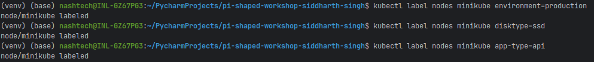
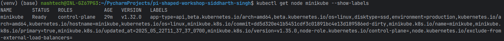
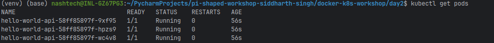
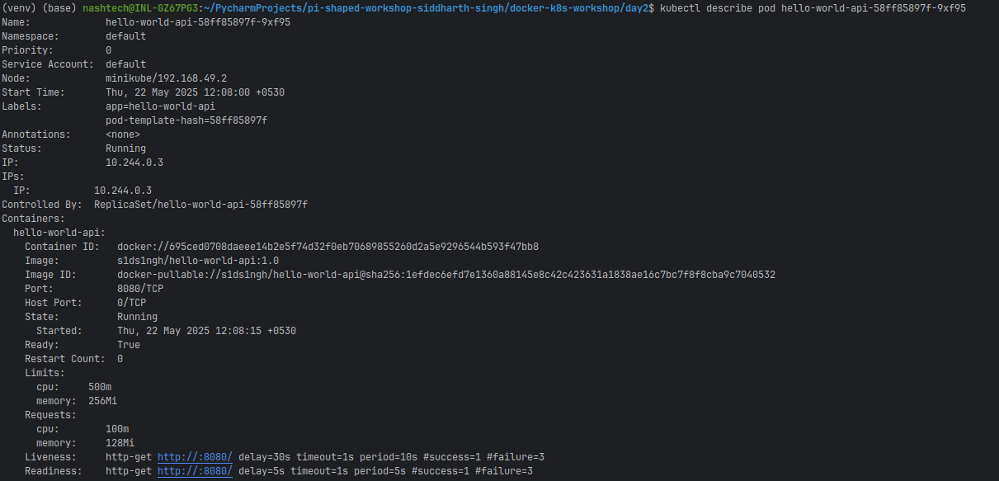
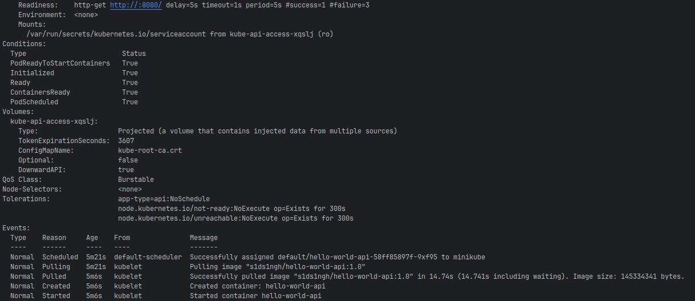

# Kubernetes Architecture, Pod Scheduling, and Node Affinity Assignment

This repository contains Kubernetes manifests for deploying the Day 1 application with resource management, pod scheduling, and node affinity configurations as part of the "Kubernetes Architecture, Pod Scheduling, Node Affinity" assignment.

## Project Overview

In this assignment, I've created Kubernetes manifests that demonstrate:
- Resource requests and limits for containers
- Node affinity rules for pod scheduling
- Tolerations for node taints
- Combined deployment configuration

The implementation uses the Hello World REST API application from Day 1, containerized and deployed to a Kubernetes cluster.

## Implementation Details

## Project Structure

- `deployment.yaml` - Basic Kubernetes deployment with resource limits and requests
- `node-affinity.yaml` - Example node and pod with affinity and toleration rules
- `combined-manifest.yaml` - Complete deployment manifest with resource management and node affinity
- `kubectl-instructions.md` - Detailed instructions for applying and verifying the deployment
- `core-concept-answers.md` - Comprehensive answers to the core concept questions

### Key Components

1. **Deployment Configuration**
   - Created a Kubernetes deployment for the Day 1 application
   - Added resource requests and limits for CPU and memory
   - Implemented health checks with liveness and readiness probes

2. **Node Affinity Rules**
   - Configured required node affinity for production environment
   - Added preferred node affinity for SSD disk type and API application type
   - Implemented with appropriate weights to prioritize scheduling decisions

3. **Tolerations**
   - Added tolerations to allow scheduling on nodes with specific taints
   - Configured for the "app-type=api:NoSchedule" taint

4. **Combined Manifest**
   - Created a comprehensive manifest that includes all configurations
   - Structured for easy application with kubectl

## Demonstration on Single-Node Minikube

This assignment was implemented and tested on a single-node Minikube cluster. While this doesn't demonstrate the full power of node affinity across multiple nodes, it successfully shows the configuration and application of the concepts.

### Implementation Steps

1. **Set up Minikube and kubectl**
   ```bash
   # Install kubectl and Minikube
   # Start Minikube
   minikube start
   ```

2. **Label the Minikube node**
   ```bash
   kubectl label nodes minikube environment=production
   kubectl label nodes minikube disktype=ssd
   kubectl label nodes minikube app-type=api
   ```

3. **Apply the combined manifest**
   ```bash
   kubectl apply -f combined-manifest.yaml
   ```

4. **Verify pod placement**
   ```bash
   kubectl get pods -o wide
   kubectl describe pod <pod-name>
   ```
## Implementation Screenshots

### Node Labels


*Figure 1.1 & 1.2: Minikube node with required labels for affinity rules*

### Deployment Application

*Figure 2: Successful application of the combined manifest*

### Pod Status

*Figure 3: Running pods scheduled on the minikube node*

### Pod Details


*Figure 4: Pod description showing node affinity and resource configurations*


### Results

The deployment successfully created three replicas of the Hello World API application. All pods were scheduled on the Minikube node as it satisfied the required node affinity conditions (having the `environment=production` label).

In a multi-node environment, these affinity rules would ensure pods only run on nodes with matching labels, providing control over workload placement based on node characteristics.

## Core Concept Questions

### Why do we set requests and limits for CPU/memory in a production-grade product?

Setting resource requests and limits for CPU and memory in a production-grade product is a critical practice that directly impacts application reliability, cluster stability, and cost efficiency. Resource requests specify the minimum amount of resources that must be available for a container to start, while limits define the maximum resources a container can consume. This dual mechanism serves multiple essential purposes in production environments.

First and foremost, resource specifications prevent resource starvation scenarios that can lead to cascading failures across services. In a production environment where multiple applications share cluster resources, unbounded resource consumption by one application can degrade performance for others or even cause system-wide instability. By setting appropriate limits, organizations establish clear boundaries that prevent any single workload from monopolizing cluster resources during unexpected traffic spikes or when experiencing bugs that cause resource leaks.

Resource requests are equally important as they enable the Kubernetes scheduler to make intelligent placement decisions. When a pod specifies resource requests, the scheduler can identify nodes with sufficient available capacity, ensuring that applications have the resources they need to function properly from the moment they start. This proactive approach to resource allocation prevents the common problem of applications being scheduled onto nodes that appear available but cannot actually support their workload requirements.

From a financial perspective, well-defined resource specifications enable more efficient infrastructure utilization and cost management. Without clear resource boundaries, organizations often over-provision infrastructure to accommodate worst-case scenarios, leading to wasted capacity and unnecessary expenses. By accurately defining the resource needs of each application component, teams can right-size their infrastructure, optimize resource utilization, and implement more precise capacity planning and cost allocation strategies.

Resource specifications also play a crucial role in application performance predictability. When applications have guaranteed access to a minimum level of resources (through requests) and clear upper bounds (through limits), their performance characteristics become more consistent and predictable. This predictability is essential for maintaining service level objectives (SLOs) and ensuring a consistent user experience, particularly for customer-facing applications where performance directly impacts business metrics.

Additionally, resource limits provide an important safety mechanism for detecting and addressing problematic application behavior. When a container attempts to exceed its memory limit, Kubernetes will terminate it with an OOM (Out of Memory) error, allowing the platform to automatically restart the container rather than letting it degrade the entire node's performance. This fail-fast approach helps teams quickly identify and fix resource-related issues before they impact other services.

### When would a product team apply node affinity in Kubernetes?

Node affinity in Kubernetes provides a sophisticated mechanism for influencing pod placement decisions based on node characteristics, and product teams apply this capability in several strategic scenarios to optimize application performance, reliability, and cost efficiency.

One of the most common use cases for node affinity is hardware optimization for specialized workloads. Product teams developing applications with specific hardware requirements—such as GPU-accelerated machine learning models, FPGA-based signal processing, or high-performance computing tasks—use node affinity to ensure these workloads run exclusively on nodes equipped with the appropriate specialized hardware. This targeted placement maximizes the performance benefits of specialized infrastructure while preventing these expensive resources from being allocated to workloads that cannot utilize them effectively.

Geographic distribution requirements also frequently drive node affinity decisions. In multi-region or globally distributed Kubernetes clusters, product teams use node affinity to ensure application components are deployed across specific geographic zones to minimize latency for users in different regions or to comply with data sovereignty regulations that require certain data to remain within specific geographic boundaries. This capability is particularly valuable for global products that must balance performance and regulatory compliance across diverse markets.

Cost optimization represents another compelling reason to implement node affinity. Many organizations operate heterogeneous clusters with different node types optimized for various price-performance profiles. Product teams can use node affinity to direct cost-sensitive, non-critical workloads to more economical node pools (such as spot instances or lower-tier hardware), while ensuring mission-critical services run on more reliable, performance-optimized nodes. This tiered approach allows organizations to significantly reduce infrastructure costs without compromising on performance for essential services.

Compliance and security requirements often necessitate node affinity configurations. Applications handling sensitive data or subject to specific regulatory frameworks may need to run on nodes with particular security features, certification levels, or isolation characteristics. By using node affinity, product teams can ensure these workloads run only on compliant infrastructure, simplifying audit processes and reducing compliance risks.

Operational considerations like workload isolation also drive node affinity adoption. Product teams may use node affinity to separate production and non-production workloads, isolate noisy neighbors that might impact other services, or segregate workloads with conflicting resource patterns. For instance, teams might configure CPU-intensive batch processing jobs to run on different nodes than latency-sensitive user-facing services, preventing resource contention that could degrade user experience.

Finally, node affinity plays a crucial role in implementing graceful upgrade strategies and ensuring high availability. Product teams can use node affinity in conjunction with anti-affinity rules to distribute application instances across different failure domains, such as different availability zones or rack locations. This distribution ensures that infrastructure failures affect only a subset of application instances, maintaining service availability even during partial outages.

## Node Affinity Rules Explanation

The node affinity configuration in this assignment demonstrates both required and preferred scheduling rules:

### Required Node Affinity

```yaml
requiredDuringSchedulingIgnoredDuringExecution:
  nodeSelectorTerms:
  - matchExpressions:
    - key: environment
      operator: In
      values:
      - production
```

This rule ensures that pods will **only** be scheduled on nodes labeled with `environment=production`. This is a hard requirement - if no nodes match this criterion, the pods will remain in a Pending state.

### Preferred Node Affinity

```yaml
preferredDuringSchedulingIgnoredDuringExecution:
- weight: 90
  preference:
    matchExpressions:
    - key: disktype
      operator: In
      values:
      - ssd
- weight: 10
  preference:
    matchExpressions:
    - key: app-type
      operator: In
      values:
      - api
```

These rules express scheduling preferences with different weights:
- Nodes with `disktype=ssd` are strongly preferred (weight 90)
- Nodes with `app-type=api` are slightly preferred (weight 10)

The scheduler will attempt to honor these preferences but will still schedule pods even if no nodes match these criteria, as long as the required affinity is satisfied.

### Tolerations

```yaml
tolerations:
- key: "app-type"
  operator: "Equal"
  value: "api"
  effect: "NoSchedule"
```

This toleration allows our pods to be scheduled on nodes that have the taint `app-type=api:NoSchedule`. Without this toleration, nodes with this taint would reject our pods.

## Conclusion

This assignment demonstrates the implementation of Kubernetes resource management and scheduling capabilities. While demonstrated on a single-node cluster, the concepts and configurations would apply directly to multi-node environments, providing powerful control over workload placement and resource allocation.

The combination of resource requests/limits and node affinity rules enables organizations to build resilient, efficient, and cost-effective Kubernetes deployments that align with business requirements and operational constraints.
