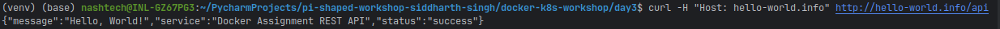
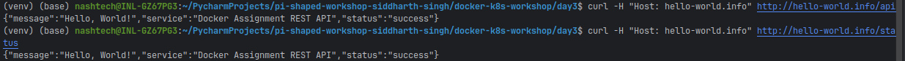

# Kubernetes Networking and Service Discovery Assignment

This repository contains the implementation of Kubernetes networking concepts, service discovery, and Ingress routing for the Day 3 assignment of the PI-Shaped Learning Program.

## Project Overview

In this assignment, I've created Kubernetes manifests that demonstrate:
- Different service types (ClusterIP and NodePort) for exposing applications
- Ingress resource with path-based routing rules
- Testing and accessing services through different networking methods

The implementation uses the Hello World REST API application from Day 1, containerized and deployed to a Kubernetes cluster.

## Implementation Details

### Service Types

#### 1. ClusterIP Service
The ClusterIP service provides internal access to the application within the Kubernetes cluster.

```yaml
apiVersion: v1
kind: Service
metadata:
  name: hello-world-api-clusterip
  labels:
    app: hello-world-api
spec:
  type: ClusterIP
  ports:
  - port: 80
    targetPort: 8080
    protocol: TCP
    name: http
  selector:
    app: hello-world-api
```

- **Purpose**: Internal service discovery within the cluster
- **Access**: Only accessible from within the Kubernetes cluster
- **Use Case**: Backend services, internal APIs, microservices communication

#### 2. NodePort Service
The NodePort service exposes the application on a static port on each node in the cluster.

```yaml
apiVersion: v1
kind: Service
metadata:
  name: hello-world-api-nodeport
  labels:
    app: hello-world-api
spec:
  type: NodePort
  ports:
  - port: 80
    targetPort: 8080
    nodePort: 30080
    protocol: TCP
    name: http
  selector:
    app: hello-world-api
```

- **Purpose**: External access to the application
- **Access**: Available at `http://<node-ip>:30080`
- **Use Case**: Development environments, testing, demos

### Ingress Configuration

The Ingress resource provides path-based routing to the application.

```yaml
apiVersion: networking.k8s.io/v1
kind: Ingress
metadata:
  name: hello-world-api-ingress
  annotations:
    nginx.ingress.kubernetes.io/rewrite-target: /$1
spec:
  rules:
  - host: hello-world.info
    http:
      paths:
      - path: /api(/|$)(.*)
        pathType: Prefix
        backend:
          service:
            name: hello-world-api-clusterip
            port:
              number: 80
      - path: /status(/|$)(.*)
        pathType: Prefix
        backend:
          service:
            name: hello-world-api-clusterip
            port:
              number: 80
```

- **Purpose**: Advanced HTTP routing, path-based rules
- **Access**: Available at `http://hello-world.info/api` and `http://hello-world.info/status`
- **Use Case**: Production environments, unified API gateway, multi-service routing

## URL Paths and Expected Responses

### 1. API Endpoint
- **URL Path**: `/api`
- **Service**: ClusterIP (hello-world-api-clusterip)
- **Expected Response**:
  ```json
  {
    "message": "Hello, World!",
    "status": "success",
    "service": "Docker Assignment REST API"
  }
  ```
- **Test Command**:
  ```bash
  curl -H "Host: hello-world.info" http://<ingress-ip>/api
  ```

### 2. Status Endpoint
- **URL Path**: `/status`
- **Service**: ClusterIP (hello-world-api-clusterip)
- **Expected Response**:
  ```json
  {
    "message": "Hello, World!",
    "status": "success",
    "service": "Docker Assignment REST API"
  }
  ```
- **Test Command**:
  ```bash
  curl -H "Host: hello-world.info" http://<ingress-ip>/status
  ```

## Testing Instructions

### Setting Up Minikube Ingress

1. Enable the Ingress addon:
   ```bash
   minikube addons enable ingress
   ```

2. Add an entry to your `/etc/hosts` file:
   ```bash
   echo "$(minikube ip)  hello-world.info" | sudo tee -a /etc/hosts
   ```

### Testing Services

1. Apply the service manifests:
   ```bash
   kubectl apply -f clusterip-service.yaml
   kubectl apply -f nodeport-service.yaml
   ```

2. Test the NodePort service:
   ```bash
   curl http://$(minikube ip):30080
   ```

### Testing Ingress

1. Apply the Ingress manifest:
   ```bash
   kubectl apply -f ingress.yaml
   ```

2. Test the Ingress endpoints:
   ```bash
   curl -H "Host: hello-world.info" http://hello-world.info/api
   curl -H "Host: hello-world.info" http://hello-world.info/status
   ```

## Core Concept Questions

### How would you expose an internal microservice (e.g., user-auth) differently than a public-facing frontend in a Kubernetes-based product?
Internal microservices like user-auth should use ClusterIP to stay accessible only within the cluster, ensuring isolation and security. Network policies can further restrict access to only necessary components like the API gateway, enforcing the principle of least privilege.

In contrast, public-facing frontends should be exposed via Ingress or LoadBalancer. Ingress offers smarter HTTP routing, TLS termination, and centralized control, making it ideal for production. LoadBalancer is simpler but more costly and less flexible, while NodePort is usually reserved for testing.

In summary, internal services prioritize privacy and access control (ClusterIP + network policies), while public frontends focus on accessibility, routing, and external security (Ingress or LoadBalancer + TLS/WAF).

### Why might a product use Ingress instead of directly exposing each microservice via LoadBalancer?
Ingress consolidates external access through a single entry point, reducing cloud costs by avoiding one LoadBalancer per service. It also enables advanced routing (host/path-based), central TLS management, and consistent security policies.

Operationally, Ingress simplifies rollout strategies (canary, A/B testing), improves observability, and integrates better with tools like service meshes and monitoring systems. In contrast, multiple LoadBalancers lack these features and scale poorly.

Overall, Ingress offers cost savings, centralized control, and production-ready capabilities—making it the preferred method for exposing microservices in Kubernetes.

## Conclusion

This assignment demonstrates the implementation of Kubernetes networking concepts, including different service types and Ingress routing. The combination of ClusterIP for internal access, NodePort for development testing, and Ingress for path-based routing provides a comprehensive approach to service exposure and discovery in Kubernetes environments.

By implementing these networking patterns, we can create a flexible, secure, and scalable architecture for microservices-based applications, balancing the needs of internal service communication with external access requirements.
