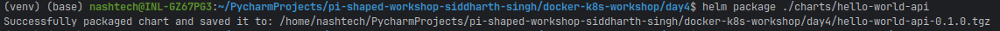
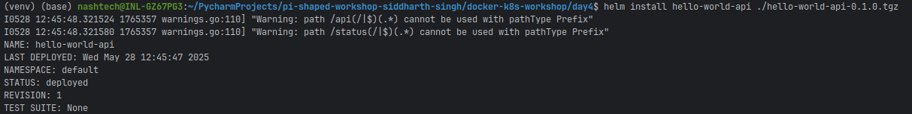
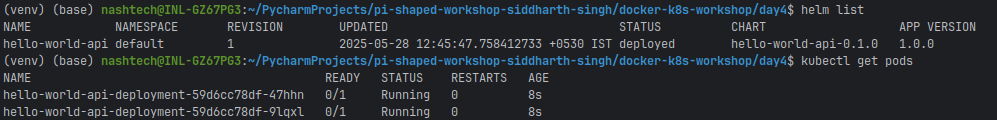
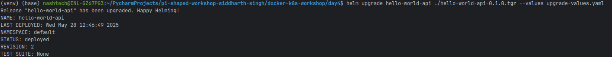
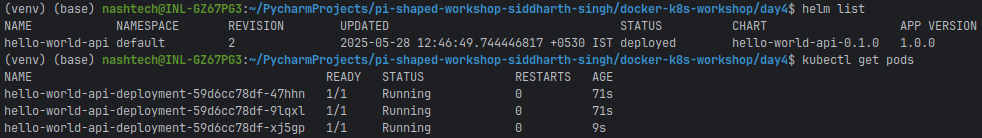
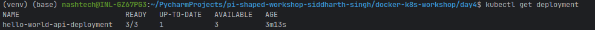

# Helm Charts and Custom Helm Templates Assignment

This repository contains a Helm chart for the Hello World API application, demonstrating the use of Helm for packaging, configuring, and deploying applications on Kubernetes.

## Project Overview

In this assignment, I've created a Helm chart that:
- Packages the Hello World API application from previous assignments
- Parameterizes key configuration values (image, port, replica count)
- Demonstrates installation and upgrade processes
- Implements best practices for Helm chart development

## Helm Chart Structure

```
charts/hello-world-api/
├── Chart.yaml           # Chart metadata
├── templates/           # Kubernetes resource templates
│   ├── deployment.yaml  # Deployment template
│   ├── service-clusterip.yaml  # ClusterIP service template
│   ├── service-nodeport.yaml   # NodePort service template
│   └── ingress.yaml     # Ingress template
└── values.yaml          # Default configuration values
```

## Parameterized Values

The following values can be customized through `values.yaml` or during installation/upgrade:

- **Image Configuration**
  - `image.repository`: Docker image repository
  - `image.tag`: Docker image tag
  - `image.pullPolicy`: Image pull policy

- **Deployment Configuration**
  - `replicaCount`: Number of pod replicas

- **Service Configuration**
  - `service.port`: Service port
  - `service.targetPort`: Container port
  - `service.nodePort`: NodePort value (for NodePort service)

- **Ingress Configuration**
  - `ingress.host`: Hostname for Ingress

- **Resource Configuration**
  - `resources.requests.memory`: Memory request
  - `resources.requests.cpu`: CPU request
  - `resources.limits.memory`: Memory limit
  - `resources.limits.cpu`: CPU limit

## Installation Instructions

### Prerequisites
- Kubernetes cluster (Minikube, kind, or cloud provider)
- Helm installed (v3.x)
- kubectl configured to communicate with your cluster

### Installing the Chart

1. Package the Helm chart:
   ```bash
   helm package ./charts/hello-world-api
   ```

2. Install the chart:
   ```bash
   helm install hello-world-api ./hello-world-api-0.1.0.tgz
   ```

3. Verify the installation:
   ```bash
   helm list
   kubectl get pods
   ```

### Upgrading the Chart

1. Create a custom values file (e.g., `upgrade-values.yaml`):
   ```yaml
   replicaCount: 5
   image:
     tag: "1.1"
   ```

2. Upgrade the release:
   ```bash
   helm upgrade hello-world-api ./hello-world-api-0.1.0.tgz --values upgrade-values.yaml
   ```

3. Verify the upgrade:
   ```bash
   helm list
   kubectl get pods
   kubectl get deployment
   ```


### Uninstalling the Chart

```bash
helm uninstall hello-world-api
```

## Core Concept Questions

### Why is Helm important for managing configuration across different environments in a real-world product (e.g., dev, staging, prod)?

Helm plays a crucial role in managing configuration across different environments in real-world products by providing a standardized, templated approach to Kubernetes resource management that addresses the complex challenges of modern application deployment.

In enterprise environments, applications typically progress through multiple stages—development, testing, staging, and production—each with its own specific configuration requirements. Without a templating system like Helm, teams would need to maintain separate sets of raw Kubernetes YAML files for each environment, leading to significant duplication and maintenance overhead. When a fundamental change is needed, such as adding a new security parameter or changing a deployment strategy, engineers would need to manually propagate this change across all environment-specific manifests, increasing the risk of inconsistencies and configuration drift. Helm solves this problem by introducing a template-based approach where environment-specific values are cleanly separated from the resource definitions themselves.

With Helm's values.yaml mechanism, organizations can maintain a single set of templates while using environment-specific value files to customize deployments for each context. For example, a production environment might specify higher replica counts, stricter resource limits, and integration with production-grade monitoring systems, while a development environment might use minimal resources, relaxed security policies, and development-specific debugging tools. This separation of concerns allows infrastructure teams to enforce consistent application architecture across all environments while still accommodating legitimate variations in configuration. When a fundamental change to the application architecture is required, it can be made once in the templates and automatically applied across all environments, ensuring consistency and reducing maintenance overhead.

Helm also facilitates collaboration between development and operations teams by providing a clear interface for configuration. Developers can focus on application code while operations teams manage environment-specific configurations, with Helm serving as the bridge between these concerns. This collaboration model is particularly valuable in organizations practicing DevOps, where cross-functional teams need efficient ways to manage deployment complexity without creating bottlenecks.

Version control integration is another key benefit of Helm for multi-environment management. Environment-specific value files can be stored alongside application code in version control systems, providing a clear audit trail of configuration changes and enabling practices like configuration review. This integration supports GitOps workflows where environment configurations are declaratively defined in repositories and automatically applied through CI/CD pipelines. When a configuration change needs to be promoted from staging to production, teams can follow established code review processes, applying the same rigor to infrastructure changes as they do to application code.

Helm's chart repository system further enhances multi-environment management by providing a centralized location for storing and distributing application packages. Organizations can maintain internal chart repositories containing pre-approved, security-hardened application templates that comply with corporate standards. These charts can then be referenced by environment-specific deployments, ensuring that all environments use consistent base configurations while still allowing for necessary customization. This approach is particularly valuable for organizations with strict compliance requirements, as it provides a mechanism for enforcing security and operational standards across all environments.

In summary, Helm's importance for managing configuration across different environments stems from its ability to separate templates from values, maintain version-controlled configuration, support collaborative workflows, and provide a standardized distribution mechanism. These capabilities directly address the challenges of modern application deployment, enabling organizations to maintain consistency while accommodating legitimate environmental differences in a scalable, maintainable way.

### How does Helm simplify deployment rollback during a production incident?

During production incidents, when every minute of downtime translates to business impact, Helm provides a robust, streamlined rollback mechanism that significantly reduces recovery time and operational complexity compared to manual Kubernetes management approaches.

Helm's revision history is the foundation of its rollback capability. Each time a release is installed or upgraded, Helm creates and stores a revision record containing the complete state of that release, including all Kubernetes resources and their configurations. This historical record is maintained within the Kubernetes cluster itself (stored as Secret resources), creating a self-contained system that doesn't rely on external databases or storage. During a production incident, when operators need to quickly restore service, this revision history provides immediate access to known-good configurations without requiring access to external systems or repositories, which might themselves be impacted by the incident.

The simplicity of Helm's rollback command is particularly valuable during high-stress incident response scenarios. With a single command—`helm rollback release-name revision-number`—operators can revert to any previous release version. This simplicity reduces the cognitive load on operators during incidents, minimizing the risk of human error when working under pressure. Compared to manually recreating or editing multiple Kubernetes resources, which would require careful coordination and precise timing, Helm's atomic rollback operation ensures that all components return to a consistent state simultaneously, preventing partial or inconsistent rollbacks that could further complicate the incident.

Helm's rollback mechanism is comprehensive, capturing all resources managed by the release. In a typical microservice application, a single release might include deployments, services, config maps, secrets, and other resources. During a rollback, Helm ensures that all these components are restored to their previous states, maintaining the critical relationships between them. This comprehensive approach is essential for complex applications where interdependencies between components mean that partial rollbacks could lead to inconsistent states and further service disruption.

The speed of Helm rollbacks is another critical factor during production incidents. Because Helm stores the complete configuration of previous releases, it can execute rollbacks without needing to rebuild or regenerate configurations. This means that recovery can begin immediately after the rollback command is issued, with no delay for template rendering or value substitution. In production environments where service level objectives (SLOs) might specify recovery time targets in minutes, this immediate response capability can be the difference between meeting and missing critical availability commitments.

Helm also provides valuable context for post-incident analysis through its revision history and rollback audit trail. After service has been restored, teams can examine the differences between the problematic release and the restored version to identify the specific changes that contributed to the incident. This information is invaluable for root cause analysis and for developing preventive measures to avoid similar issues in the future. The clear record of what was changed and when it was changed helps teams understand the incident timeline and improve their deployment processes.

Beyond simple rollbacks, Helm's revision history supports more sophisticated incident response strategies. For example, teams might choose to create a new release based on a previous revision but with specific patches applied to address the immediate issue. This approach combines the stability of a known-good configuration with targeted fixes, providing a more nuanced response option when a simple rollback might not be sufficient. The ability to inspect previous revisions and understand exactly what they contain enables these more sophisticated approaches to incident management.

In summary, Helm simplifies deployment rollback during production incidents through its comprehensive revision history, simple command interface, all-or-nothing rollback semantics, rapid execution, and detailed audit trail. These capabilities directly address the challenges of incident response in complex Kubernetes environments, enabling teams to restore service quickly and confidently while minimizing the risk of further complications.

## Submission Checklist

- [x] charts/hello-world-api/ (Helm chart directory)
- [x] values.yaml
- [ ] Screenshot of Helm install and upgrade commands (to be added by you)
- [x] README.md with install/upgrade instructions

## Additional Resources

- [Helm Documentation](https://helm.sh/docs/)
- [Helm Best Practices](https://helm.sh/docs/chart_best_practices/)
- [Helm Chart Development Tips and Tricks](https://helm.sh/docs/howto/charts_tips_and_tricks/)

## Conclusion

This assignment demonstrates the use of Helm for packaging, configuring, and deploying applications on Kubernetes. By parameterizing key values and using templates, we've created a flexible and reusable deployment solution that can be easily customized for different environments and requirements.
