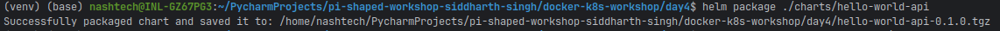
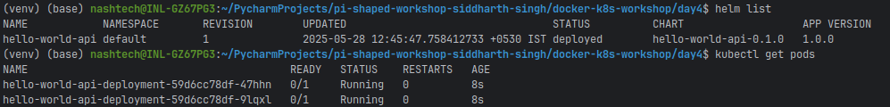

# Helm Charts and Custom Helm Templates Assignment

This repository contains a Helm chart for the Hello World API application, demonstrating the use of Helm for packaging, configuring, and deploying applications on Kubernetes.

## Project Overview

In this assignment, I've created a Helm chart that:
- Packages the Hello World API application from previous assignments
- Parameterizes key configuration values (image, port, replica count)
- Demonstrates installation and upgrade processes
- Implements best practices for Helm chart development

## Helm Chart Structure

```
charts/hello-world-api/
├── Chart.yaml           # Chart metadata
├── templates/           # Kubernetes resource templates
│   ├── deployment.yaml  # Deployment template
│   ├── service-clusterip.yaml  # ClusterIP service template
│   ├── service-nodeport.yaml   # NodePort service template
│   └── ingress.yaml     # Ingress template
└── values.yaml          # Default configuration values
```

## Parameterized Values

The following values can be customized through `values.yaml` or during installation/upgrade:

- **Image Configuration**
  - `image.repository`: Docker image repository
  - `image.tag`: Docker image tag
  - `image.pullPolicy`: Image pull policy

- **Deployment Configuration**
  - `replicaCount`: Number of pod replicas

- **Service Configuration**
  - `service.port`: Service port
  - `service.targetPort`: Container port
  - `service.nodePort`: NodePort value (for NodePort service)

- **Ingress Configuration**
  - `ingress.host`: Hostname for Ingress

- **Resource Configuration**
  - `resources.requests.memory`: Memory request
  - `resources.requests.cpu`: CPU request
  - `resources.limits.memory`: Memory limit
  - `resources.limits.cpu`: CPU limit

## Installation Instructions

### Prerequisites
- Kubernetes cluster (Minikube, kind, or cloud provider)
- Helm installed (v3.x)
- kubectl configured to communicate with your cluster

### Installing the Chart

1. Package the Helm chart:
   ```bash
   helm package ./charts/hello-world-api
   ```

2. Install the chart:
   ```bash
   helm install hello-world-api ./hello-world-api-0.1.0.tgz
   ```

3. Verify the installation:
   ```bash
   helm list
   kubectl get pods
   ```

### Upgrading the Chart

1. Create a custom values file (e.g., `upgrade-values.yaml`):
   ```yaml
   replicaCount: 5
   image:
     tag: "1.1"
   ```

2. Upgrade the release:
   ```bash
   helm upgrade hello-world-api ./hello-world-api-0.1.0.tgz --values upgrade-values.yaml
   ```

3. Verify the upgrade:
   ```bash
   helm list
   kubectl get pods
   kubectl get deployment
   ```


### Uninstalling the Chart

```bash
helm uninstall hello-world-api
```

## Core Concept Questions

### Why is Helm important for managing configuration across different environments?
Helm streamlines configuration management across environments (dev, staging, prod) by separating Kubernetes resource templates from environment-specific values. Instead of duplicating YAML files for each environment, teams maintain one set of templates and apply different values using values.yaml, ensuring consistency and reducing maintenance overhead.

This templating approach supports environment-specific configurations (e.g., scaling, security, monitoring) without altering core infrastructure. Helm also promotes collaboration between dev and ops, integrates with version control for GitOps workflows, and supports centralized chart repositories to enforce standards and compliance. Overall, it enables scalable, maintainable, and consistent deployments across all environments.

### How does Helm simplify deployment rollback during a production incident?
Helm simplifies rollbacks through a built-in revision history that stores the complete state of each release. In an incident, teams can instantly revert to a previous stable version using a single helm rollback command, avoiding manual edits and reducing recovery time.

This atomic rollback restores all managed resources consistently, preventing partial failures. Helm’s fast, audit-friendly rollback mechanism supports root cause analysis and more advanced recovery strategies, making it a reliable tool for minimizing downtime and operational risk during incidents.
## Conclusion

This assignment demonstrates the use of Helm for packaging, configuring, and deploying applications on Kubernetes. By parameterizing key values and using templates, we've created a flexible and reusable deployment solution that can be easily customized for different environments and requirements.
