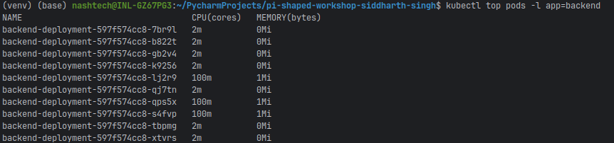

# Day 5: Real-world Kubernetes Use Cases & Optimization

This project demonstrates deploying a two-tier application (frontend and backend) in Kubernetes with a focus on performance tuning and cost optimization strategies. Key Kubernetes concepts like resource limits, liveness/readiness probes, and Horizontal Pod Autoscaling (HPA) are implemented and explained.

## Project Overview

The goal of this assignment is to apply Kubernetes concepts to a simulated real-world scenario, emphasizing stability, reliability, and efficiency. We deploy a simple frontend (using Nginx) and a backend (using BusyBox) and implement several optimization techniques.

## Directory Structure

```
/k8s_optimization
├── frontend-deployment.yaml  # Frontend Deployment manifest
├── frontend-service.yaml     # Frontend Service manifest
├── backend-deployment.yaml   # Backend Deployment manifest
├── backend-service.yaml      # Backend Service manifest
├── hpa.yaml                  # Horizontal Pod Autoscaler manifest for backend
├── todo.md                   # Task checklist (Internal Use)
└── README.md                 # This file
```

## Implemented Optimization Strategies

Several optimization strategies related to performance, reliability, and cost have been implemented:

1.  **Resource Requests and Limits**: Both frontend and backend deployments include `resources.requests` and `resources.limits` for CPU and memory. 
    *   **Performance/Reliability**: Setting requests guarantees the minimum resources needed, improving scheduling and preventing resource starvation. Limits prevent containers from consuming excessive resources, protecting other workloads on the node and preventing pod crashes due to Out-Of-Memory (OOM) errors.
    *   **Cost**: Defining appropriate requests and limits allows for better node packing and resource utilization, potentially reducing the number of nodes required and lowering infrastructure costs.
    *   *Refer to comments within `frontend-deployment.yaml` and `backend-deployment.yaml` for specific values and rationale.*

2.  **Liveness and Readiness Probes**: Both deployments utilize probes.
    *   **Performance/Reliability**: Readiness probes ensure traffic is only sent to pods that are fully initialized and ready to serve, preventing users from hitting unresponsive instances. Liveness probes detect and automatically restart containers that have become unresponsive (e.g., due to deadlocks or errors), ensuring self-healing and maintaining service availability.
    *   *Refer to comments within `frontend-deployment.yaml` and `backend-deployment.yaml` for probe configurations.*

3.  **Horizontal Pod Autoscaler (HPA)**: An HPA is configured for the backend deployment based on CPU utilization.
    *   **Performance/Reliability**: HPA automatically scales the number of backend pods based on load (CPU usage). This ensures sufficient capacity during traffic surges (like flash sales or seasonal peaks), maintaining application responsiveness and preventing performance degradation.
    *   **Cost**: HPA automatically scales down the number of pods during periods of low traffic, reducing resource consumption and infrastructure costs compared to static provisioning for peak load.
    *   *Refer to `hpa.yaml` and its comments for configuration details (e.g., target CPU utilization, min/max replicas).*

## Implementation and Testing Instructions

Detailed instructions for applying the manifests, generating load to trigger the HPA, and capturing evidence of the scaling event are provided below:

### Prerequisites

1.  **Kubernetes Cluster**: Ensure your Minikube or other Kubernetes cluster is running.
2.  **kubectl**: Configured to interact with your cluster.
3.  **Metrics Server**: HPA relies on metrics provided by the Kubernetes Metrics Server. Enable it in Minikube if you haven't already:
    ```bash
    minikube addons enable metrics-server
    ```
    Wait a minute or two for the metrics server to start collecting data. You can check its status with `kubectl get pods -n kube-system`.

### Step 1: Apply All Manifests

Apply the deployment, service, and HPA manifests:

```bash
# Apply frontend deployment and service
kubectl apply -f frontend-deployment.yaml
kubectl apply -f frontend-service.yaml

# Apply backend deployment and service
kubectl apply -f backend-deployment.yaml
kubectl apply -f backend-service.yaml

# Apply the Horizontal Pod Autoscaler for the backend
kubectl apply -f hpa.yaml
```

### Step 2: Verify Initial State (Capture Evidence - Before Scaling)

Check that everything is running correctly and capture the initial state:

```bash
# Check backend pods
kubectl get pods -l app=backend

# Check HPA status (it might take a minute to fetch metrics)
kubectl get hpa backend-hpa
# Look for the current CPU utilization under TARGETS (e.g., <unknown>/50% or 1%/50%)
```

Initially, the backend should have 3 replicas, and the CPU utilization should be low. **Capture screenshots of these outputs for the "Before Scaling" section below.**

### Step 3: Generate Load to Trigger Scaling

We need to increase the CPU load on the backend pods to exceed the 50% target defined in the HPA. We can do this by running a command that consumes CPU inside the backend pods.

1.  **Open multiple terminals** or run the load generation command in the background multiple times.
2.  **Execute a CPU-intensive command** inside one of the backend pods. Find a backend pod name first:
    ```bash
    kubectl get pods -l app=backend
    # Pick one pod name, e.g., backend-deployment-xxxx
    ```
3.  Run the load command in the pod (replace `[backend-pod-name]` with the actual name):
    ```bash
    # Run this command in several terminals or loop it to generate sustained load
    kubectl exec -it [backend-pod-name] -- /bin/sh -c "while true; do dd if=/dev/zero of=/dev/null; done"
    ```
    *Note: You might need to run this command targeting multiple backend pods simultaneously to significantly raise the *average* CPU utilization across all pods.*

### Step 4: Monitor HPA and Pod Scaling (Capture Evidence - During Scaling)

While the load generation is running, monitor the HPA status and the number of backend pods. **Capture screenshots of these outputs for the "During Scaling" section below.**

```bash
# Watch the HPA status (updates every ~15-30 seconds)
kubectl get hpa backend-hpa -w

# Check pod CPU usage
kubectl top pods -l app=backend

# Check backend pods again to see increased count
kubectl get pods -l app=backend
```

You should observe:
1.  The `TARGETS` value in the HPA output increasing above 50%.
2.  The `REPLICAS` count in the HPA output increasing from 3 towards the maximum of 10.
3.  New backend pods being created (`kubectl get pods` output).
4.  High CPU usage in `kubectl top pods` output.

### Step 5: Stop Load Generation

Once you have captured the scaling evidence, stop the load generation commands (e.g., by pressing `Ctrl+C` in the terminals where `kubectl exec` is running).

After stopping the load, you can continue monitoring the HPA and pods. The replica count should eventually scale back down to the minimum of 3 as the average CPU utilization drops.

## Core Concept Questions

1.  **Why are liveness and readiness probes critical in keeping a product’s user experience stable and reliable?**
    Readiness probes ensure traffic only goes to healthy, ready pods, preventing users from encountering errors or slow responses from pods that are starting up or temporarily busy. Liveness probes detect unresponsive or crashed containers and trigger automatic restarts, ensuring application self-healing and minimizing downtime. Together, they guarantee a stable and reliable user experience by intelligently managing traffic flow and automating failure recovery.

2.  **How does HPA help in handling flash sales, seasonal load spikes, or traffic surges in real-world applications like an e-commerce platform?**
    HPA automatically adjusts the number of running pods based on metrics like CPU or memory usage. During load spikes (flash sales, seasonal traffic), HPA scales up the number of pods to meet the increased demand, maintaining performance and availability. When the load decreases, HPA scales down the pods, optimizing resource usage and reducing infrastructure costs. This elasticity allows applications like e-commerce platforms to handle variable traffic efficiently and cost-effectively.

## Implementation Evidence (Screenshots)

Capture the following evidence during the testing process (Steps 2 and 4 above) and insert the screenshots below:

### Before Scaling

Show the initial state of the backend deployment before applying CPU load.

**Initial Pod Status:**


*Figure 1: Initial state showing 3 backend pods running before load generation.*

**Initial HPA Status:**


*Figure 2: Initial HPA status showing low CPU utilization target percentage and 3 replicas.*

### During Scaling

Show the state of the backend deployment while the CPU load is high and the HPA is actively scaling.

**HPA Status During Scaling:**


*Figure 3: HPA status showing increased replica count and high CPU utilization target percentage during the load test.*

**Pod CPU Usage During Scaling:**


*Figure 4: Pod resource usage showing high CPU consumption in backend pods during the scaling event.*

**Pod Status During Scaling:**


*Figure 5: Backend pods status showing more than 3 replicas running due to HPA scaling.*

## Conclusion

This assignment demonstrates the practical application of key Kubernetes features for building resilient, scalable, and optimized applications. By implementing resource management, health checks, and autoscaling, we can create systems that adapt to changing loads, recover from failures automatically, and utilize resources efficiently, leading to better performance, reliability, and cost-effectiveness.

